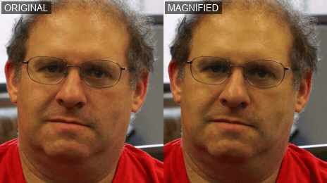
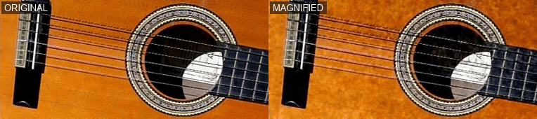

# Video magnification

A local app that runs several published video-magnification and rPPG methods behind one UI. The core is the MIT [Eulerian Video Magnification](https://people.csail.mit.edu/mrub/evm/) paper (Wu et al., SIGGRAPH 2012): band-pass a temporal frequency range, amplify it, recompose.

Five modes:

- Color magnification, [Eulerian Video Magnification](https://github.com/brycedrennan/eulerian-magnification). Amplifies periodic color change such as pulse.
- Motion magnification, [STB-VMM](https://github.com/RLado/STB-VMM). Swin-transformer model that amplifies small displacements.
- Heart rate from face video, [rPPG-Toolbox](https://github.com/ubicomplab/rPPG-Toolbox) (POS, CHROM, GREEN, ICA, LGI, PBV).
- Live webcam vitals, [pyVHR](https://github.com/phuselab/pyVHR). Heart rate and HRV over a WebSocket.
- Audio recovery from visual vibration, [Visual Microphone](https://github.com/joeljose/Visual-Mic).

*Face, before and after color magnification. Skin color oscillates at the pulse rate.*

*Guitar, before and after motion magnification. String vibration amplified past visibility.*
