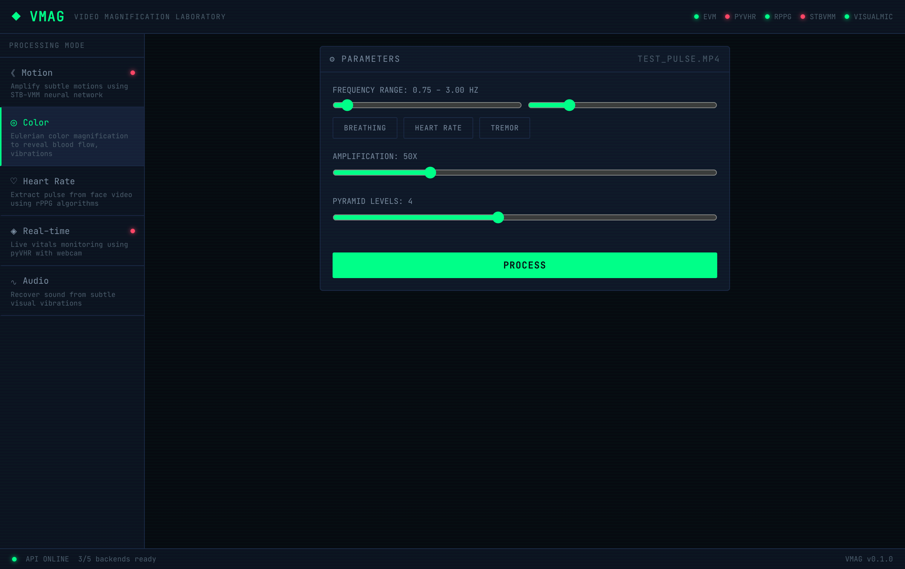
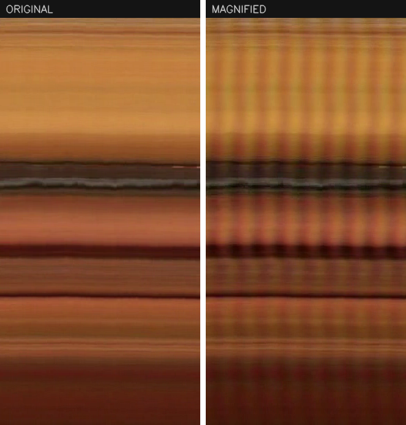
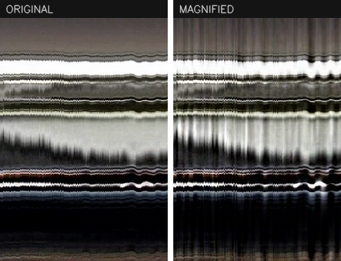

# Video magnification

I'm Roy Vaid. This is a local app for amplifying changes in video that are too small to notice, then playing back what was hidden: the color shift in a face as blood moves through it, or a beam swaying a fraction of a millimeter under load.

I started it after reading the MIT [Eulerian Video Magnification](https://people.csail.mit.edu/mrub/evm/) paper (Wu et al., SIGGRAPH 2012). The part that got me was that a plain webcam already records your pulse, and all that stands between the raw frames and seeing it is the right temporal filter. I wanted one place to try the different methods on my own clips instead of cloning five repos every time I had an idea.

## What it does

Five modes, each wrapping a published method:

- Color magnification with [Eulerian Video Magnification](https://github.com/brycedrennan/eulerian-magnification). Band-pass a chosen frequency range in time, scale it up, add it back. This is the one that surfaces a pulse or slow color change.
- Motion magnification with [STB-VMM](https://github.com/RLado/STB-VMM), a Swin-transformer model that amplifies small displacements rather than color.
- Heart rate from a face video using the [rPPG-Toolbox](https://github.com/ubicomplab/rPPG-Toolbox) algorithms (POS, CHROM, GREEN, ICA, LGI, PBV).
- Live vitals from a webcam using [pyVHR](https://github.com/phuselab/pyVHR) over a WebSocket, with heart rate and HRV updating while you sit in front of the camera.
- Audio recovery from visual vibration, following the [Visual Microphone](https://github.com/joeljose/Visual-Mic) approach: read sound back off the tiny vibrations an object shows on camera.

[](figures/app.png)

*The app. Pick a mode, set the frequency band and amplification, run it.*

## A couple of results

These come from the MIT EVM sample clips run through the color and motion paths. Each figure is a single column of pixels taken from the video and stacked left to right over time, so the horizontal axis is time. A still scene gives smooth horizontal bands. A periodic signal turns into vertical stripes.

[](figures/color-pulse.png)

*One column of a face video over about ten seconds. The original on the left is smooth. After color magnification the vertical banding on the right is the pulse, roughly one band per heartbeat.*

[](figures/motion-vibration.png)

*Subway footage. After motion magnification the bright edges wobble where the original holds almost still, which is the structure vibrating as a train passes.*

## Running it

Backends are vendored under `backends/`. Model weights download separately.

```bash
bash scripts/download_weights.sh             # model checkpoints
python -m venv .venv && source .venv/bin/activate
pip install -r requirements.txt
cd frontend && npm install && cd ..

uvicorn api.main:app --reload --port 8001    # backend
cd frontend && npm run dev                   # frontend, in a second terminal
```

The sample clips live in `test-videos/`, pulled from the MIT EVM project; that folder's README lists the per-clip frequency bands and amplification factors I used.
